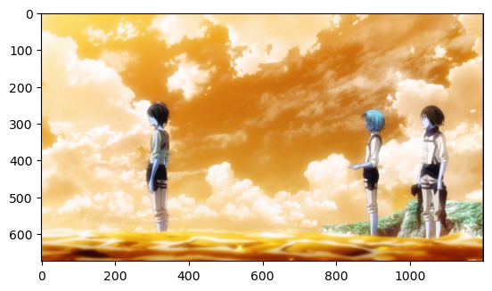
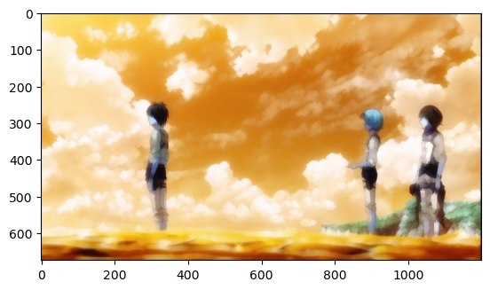
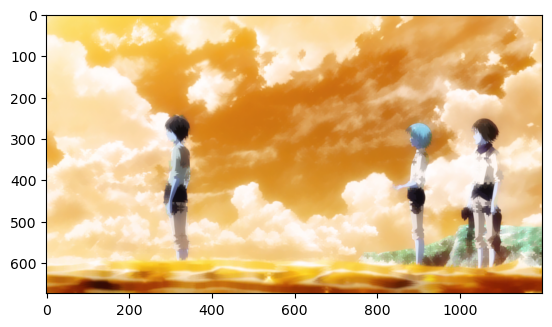

# Opening-and-Closing

## Aim

To implement Opening and Closing using Python and OpenCV.

## Software Required

1. Anaconda - Python 3.7
2. OpenCV

## Algorithm:

### Step 1:

Import the necessary packages.

### Step 2:

Read the image.

### Step 3:

Create the structuring element.

### Step 4:

Use Opening operation.

### Step 5:

Use Closing Operation.

### Step 6:

Display all the output images.

## Program:

```Python
# Developed By   : Pradeesh S
# Register Number: 212221240038

# Import the necessary packages

import cv2
import matplotlib.pyplot as plt

# Opening The Image

img=cv2.imread("senku.jpg")
plt.imshow(img)

# Create the structuring element

kernel=cv2.getStructuringElement(cv2.MORPH_CROSS,(11,11))

# Use Opening operation

img1=cv2.morphologyEx(img,cv2.MORPH_OPEN,kernel)
plt.imshow(img1)

# Use Closing Operation

img2=cv2.morphologyEx(img,cv2.MORPH_CLOSE,kernel)
plt.imshow(img2)

```

## Output:

### Display the input Image



### Display the result of Opening



### Display the result of Closing



## Result

Thus the Opening and Closing operation is used in the image using python and OpenCV.
